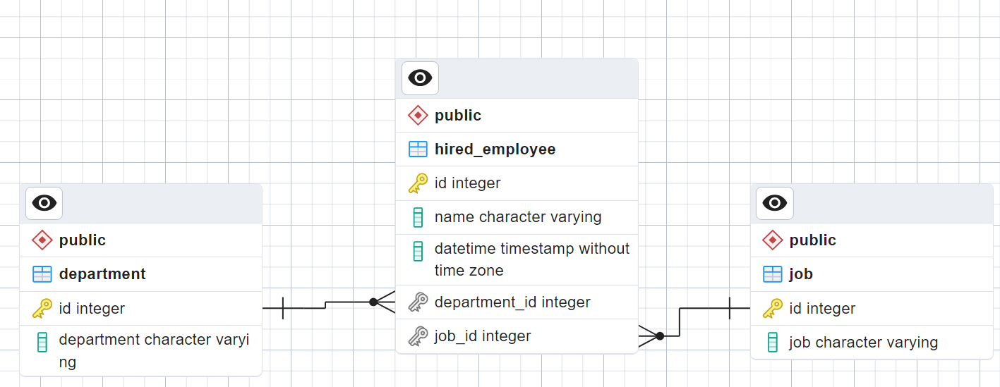
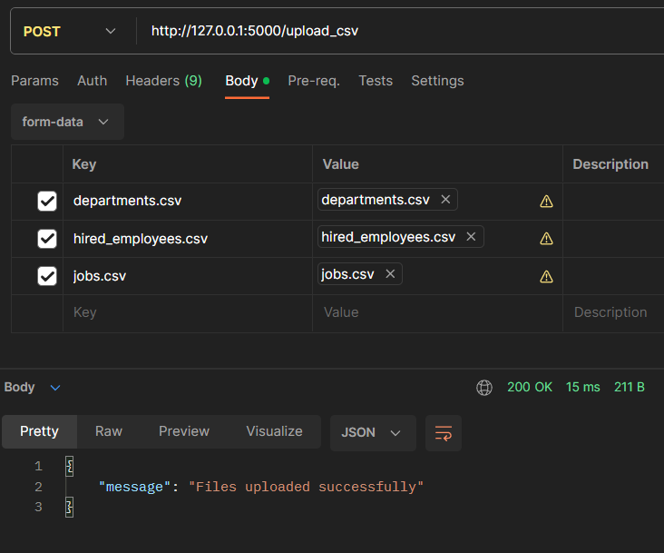
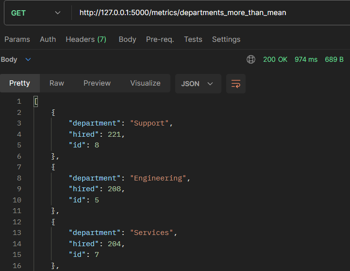
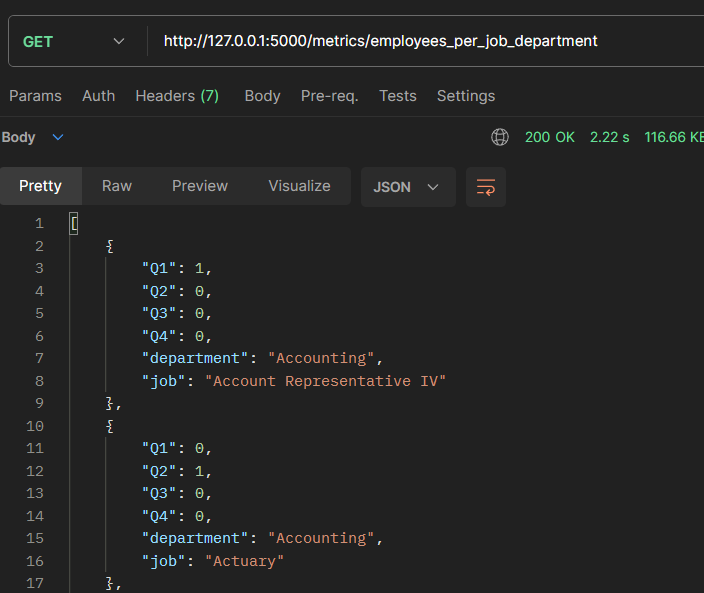
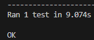

# Globant Data Engineering Coding Challenge

Welcome to the Globant Data Engineering Coding Challenge. In this challenge, I've implemented a local REST API for a database migration with three tables (departments, jobs, employees). Additionally, I explored the data and created endpoints for specific metrics for the stakeholders. Let's walk through the sections and features.

## Section 1: API

### 1. Receive historical data from CSV files
- The API provides an endpoint `/upload_csv` to receive historical data from CSV files in  **multipart/form-data**.
- Files can be uploaded using the `files` parameter in a POST request.

### 2. Upload these files to the new DB
- Upon receiving CSV files, the API inserts the data into a SQL database.
- Database details can be configured in the application.

### 3. Be able to insert batch transactions
- The API supports batch transactions for inserting 1 to 1000 rows with a single request.
- Batch processing is implemented to optimize data insertion.

**Setup and Run Instructions:**
1. Clone the repository.
2. Install dependencies using `pip install -r requirements.txt`.
3. Configure the database connection details in `app.py`.
4. Run the application using `python app.py`.

**Images Functionality**



## Section 2: SQL

### 1. Number of employees hired for each job and department in 2021 divided by quarter
- Endpoint: `/metrics/employees_per_job_department`
- Outputs a table sorted alphabetically by department and job with quarterly hiring metrics.

### 2. List of ids, name, and number of employees hired for each department
- Endpoint: `/metrics/departments_more_than_mean`
- Outputs a table of departments that hired more employees than the mean, sorted by the number of employees hired (descending).

**Images Functionality**





## Section 3: Bonus Track! Cloud, Testing & Containers

**Testing Library Used:**
- [unittest](https://docs.python.org/3/library/unittest.html)

### Unit Test: Uploading CSV Files and Database Population


This unit test focuses on the functionality of uploading CSV files containing department, job, and hired employee data to the Flask application. The test ensures that the uploaded data is correctly stored in the associated database tables (Department, Job, and HiredEmployee).

## Steps

1. **Database Setup:**
   - The test creates the necessary database tables using `db.create_all()` within the Flask application context.

2. **CSV File Creation:**
   - Three mock CSV files are created, each containing sample data for departments, jobs, and hired employees.

3. **FileStorage Objects:**
   - FileStorage objects are generated for each CSV file, simulating file uploads during a POST request.

4. **File Upload and Database Population:**
   - The Flask test client sends a POST request to the `/upload_csv` endpoint with the simulated file uploads.
   - The response status code and JSON message are checked to ensure successful file uploads.

5. **Database Verification:**
   - The test queries the database tables (Department, Job, and HiredEmployee) to verify that the uploaded data matches the expected values.

## Test Methods

1. **test_upload_csv_success:**
   - Validates successful file uploads and checks if the data is correctly populated in the database.

2. **test_upload_csv_invalid_file:**
   - Verifies that attempting to upload an invalid file results in an appropriate error response.

3. **test_upload_csv_missing_data:**
   - Ensures that missing data in one of the CSV files leads to an invalid request response, and the database remains unchanged.

## Running the Test

To run the unit test, execute the following command in the terminal:

```bash
python test_app.py
```


### DockerFile
To build and run the application locally, create the **.env**
To build the image, execute the following command:
```bash
docker-compose build
```
To run the services, execute the following command:
```bash
docker-compose up -d
```
To run database migrations, execute the following commands:
```bash
docker-compose run --rm web flask db init
docker-compose run --rm web flask db migrate
docker-compose run --rm web flask db upgrade
```
## The CSV Files Structures

### hired_employees.csv
| Field         | Type    | Description                                             |
|---------------|---------|---------------------------------------------------------|
| id            | INTEGER | Id of the employee                                      |
| name          | STRING  | Name and surname of the employee                        |
| datetime      | STRING  | Hire datetime in ISO format                             |
| department_id | INTEGER | Id of the department which the employee was hired for   |
| job_id        | INTEGER | Id of the job which the employee was hired for          |

### departments.csv
| Field      | Type    | Description                 |
|------------|---------|-----------------------------|
| id         | INTEGER | Id of the department        |
| department | STRING  | Name of the department      |

### jobs.csv
| Field | Type    | Description           |
|-------|---------|-----------------------|
| id    | INTEGER | Id of the job         |
| job   | STRING  | Name of the job       |


## Conclusion

Thank you for reviewing my solution to the Globant Data Engineering Coding Challenge. If you have any questions or feedback, please feel free to reach out.
